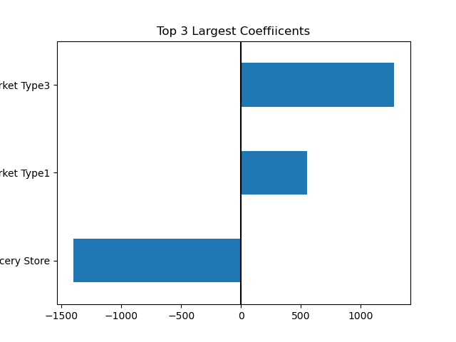
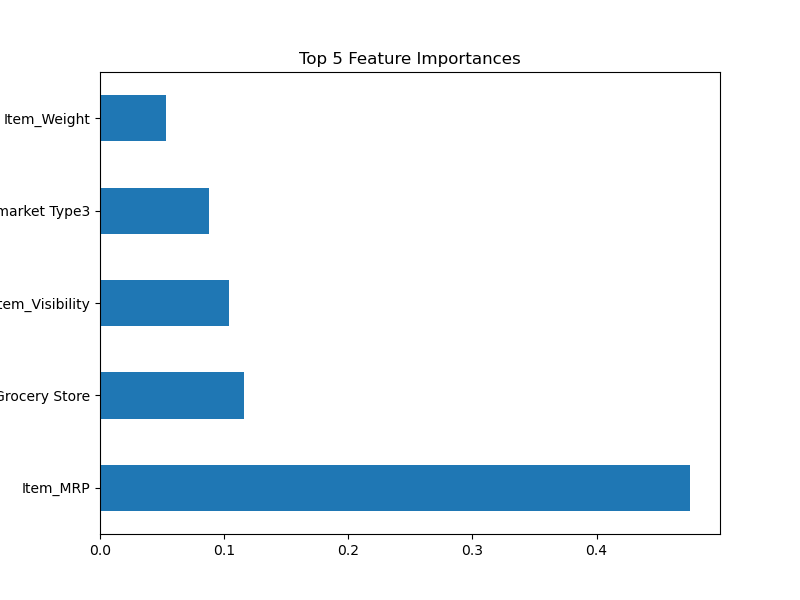
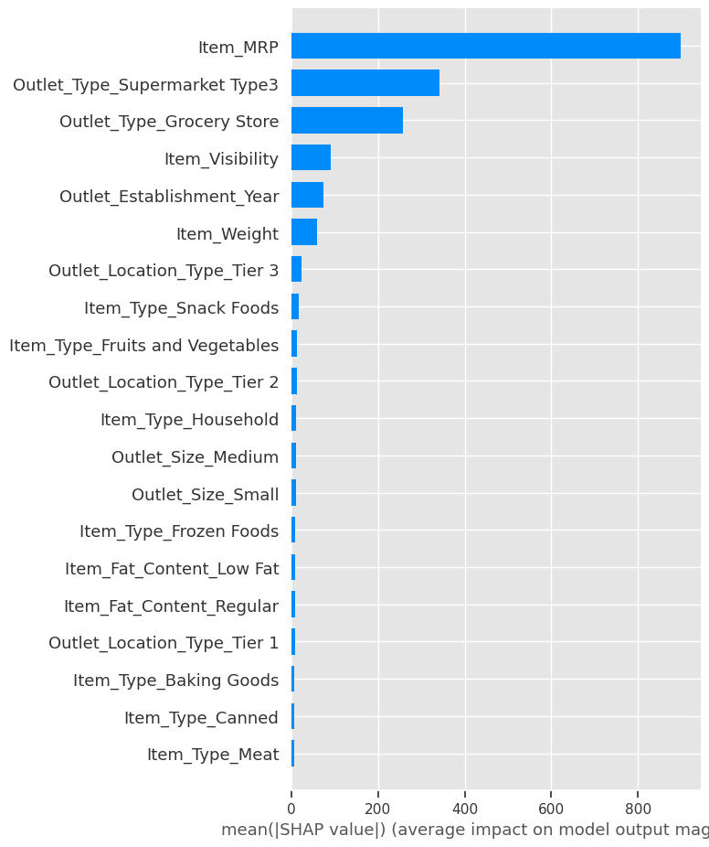
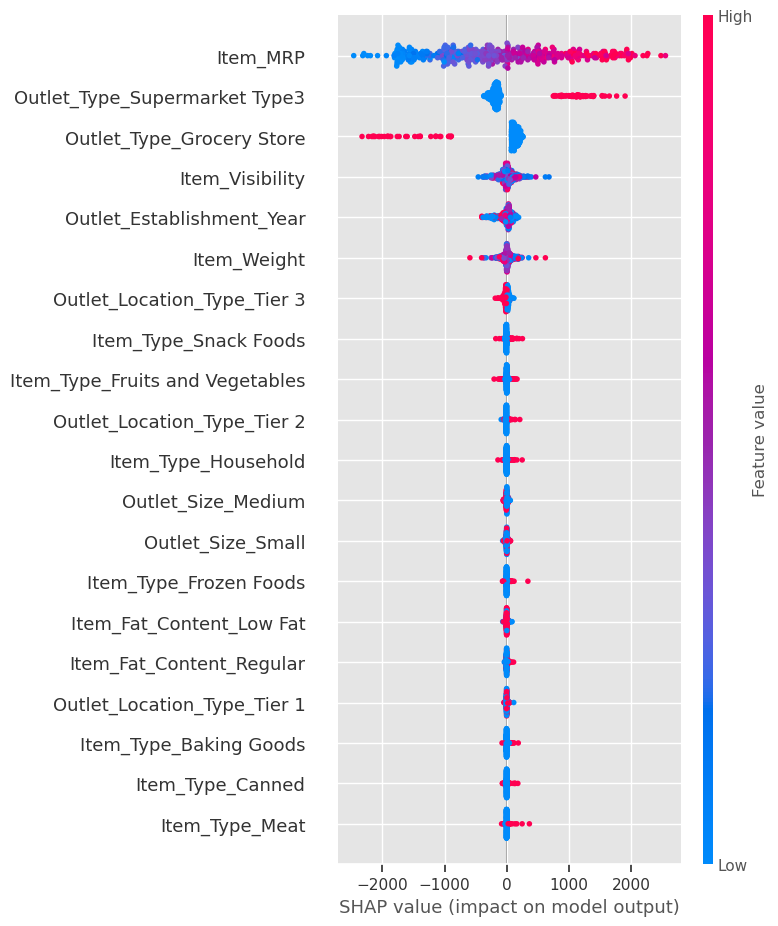
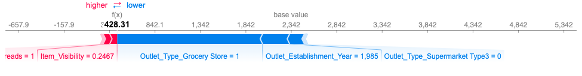
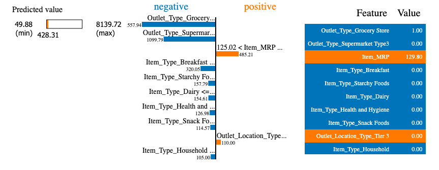
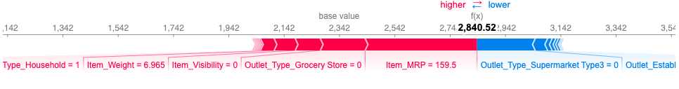
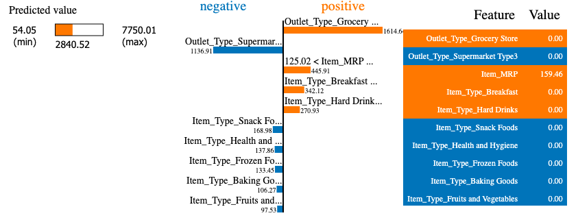

# Food Sales Predictions
## Using different variables to predict food sales in stores

**Alexander Re** 

### Business problem:

How do variables such as Item Type, Visibility, Outlet Type, and Outlet Size impact the sale of items in a store?

### Data Source: 
https://datahack.analyticsvidhya.com/contest/practice-problem-big-mart-sales-iii/

### Tableu Dashboard Link
https://public.tableau.com/app/profile/alexander.re7304/viz/ItemOutletSalesDashboard/ItemOutletSalesDashboard?publish=yes

## To prepare this data, the data was cleaned, and the following processes were performed:

### Explanatory Data Analysis
#### - A histogram was used to determine the distribution of Item Outlet Sales.
#### - Histograms and boxplots were used on all categorical data.

> The histogram shows that the majority of sales were around 2000 rupees.

### Exploratory Data Analysis
#### - This bar graph shows the mean amount of sales for each outlet type.

> Supermarket Type 3 had the highest amount of sales, with an average of over 3,500 rupees.
> Grocery Stores had the lowest amount of sales, with an average of just under 500 rupees. 

#### - This bar graph shows the average sales for each item type. 

> By a small margin, starchy foods had the most sales, with an average of 2,500 rupees.
> Three of the lowest selling item types were baking goods, soft drinks, and a category listed as "other."

## Model

The model used was a Decision Tree Regression Model. 

### Important metrics
#### Train
- MAE: 762.610
- MSE: 1172122.773
- RMSE: 1082.646
- R2: 0.603
#### Test
- MAE: 738.317
- MSE: 1118185.97
- RMSE: 1057.443
- R2: 0.594

>This model performed relatively well, with an R2 score of 0.603 for the train data and 0.594 for the test data. Because the R2 values are close together, the model has a low variance. 

#### LinearRegressions Coefficients

>The top 3 largest coefficients were all outlet types- supermarket type 1, type 3, and grocery stores.
>These had the most impact on the model predictions. Type 3 and Type 1 had a positive correlation with outlet sales, while grocery stores had a negative correlation wit outlet sales.

#### RandomForest Importances

>This graph shows the top 5 feature importances in my Random Forest Model.
>The graph tells us that the model used Item_Weight, Outlet_Type_Supermarket_Type3, Item_Visibility, Outlet_Type_Grocery_Store, and Item_MRP more than any other columns in the dataset. 

#### SHAP Importances

>The most important features according to SHAP and the feature importances graph are very similar, but there are some differences. Item visibility was labeled as less important by SHAP, and Item_Weight was not in SHAP's top 5 importances.

#### Dot Graph

 >For the feature Item_MRP, there were a wide range of high and low values that had an impact on the model. Rows that were Supermarket Type 3 had a higher impact on the model than rows that were not. This is contrary to grocery stores, where those that were not grocery stores had a higher impact on the model than those that were not.
 
 ### Local Explanations
 -I am going to use an item with high visibility and an item with low visibility as examples for the plots below. This is because item visibility was one of the most important features, but the SHAP plot showed low SHAP values for many of the data points.
 
 #### High Visibility Force Plot

 >For this row, item visibility has a positive impact on the prediction, while being a grocery store and being established in 1985 have a negative impact on the prediction.
 
 #### High Visibility Lime Plot

 >The fact that this row was a grocery store and not a supermarket type 3 had the highest impact. The item MRP had a positive impact.
 
 
 #### Low Visibility Force Plot

 >For this row, a low visibility, an MRP of 159.5, and a weight of 6.965 have a positive impact on the prediction, while not being a supermarket type 3 has a negative impact on the prediction.
 
 
 #### Low Visibility Lime Plot

 >The fact that this row is not a grocery store or supermarket type 3 have the largest impact. The third largest impact was the item MRP, which had a positive impact.

## Recommendations:

Based on the exploratory data, I reccommend that more resources should be allocated towards Type 3 Supermarkets, as they provide the most amount of value out of all store types. I would also reccommend that more effort should be put into advertising soft drinks and baking goods, in order to increase sales. These were some of the lowest selling items. 

## Limitations & Next Steps

This data can be used to help understand what can be improved in each store. For example, after viewing the low sales of grocery stores, more data can be collected on why they are doing so poorly. After collecting this data, steps can be taken to help mitigate the issues. 
